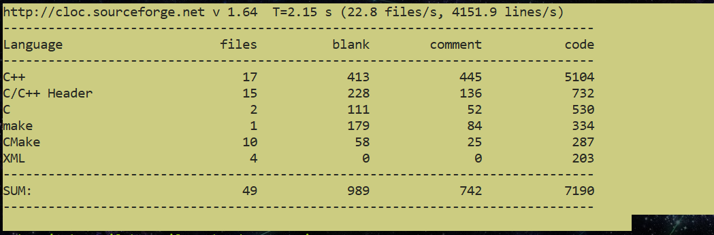
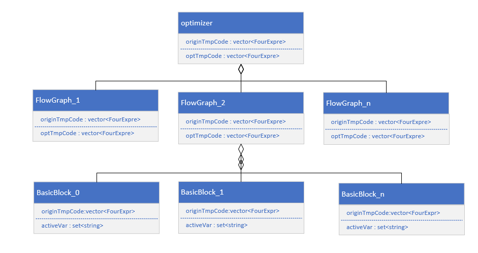
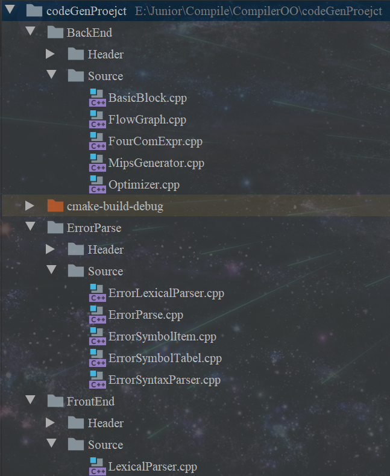
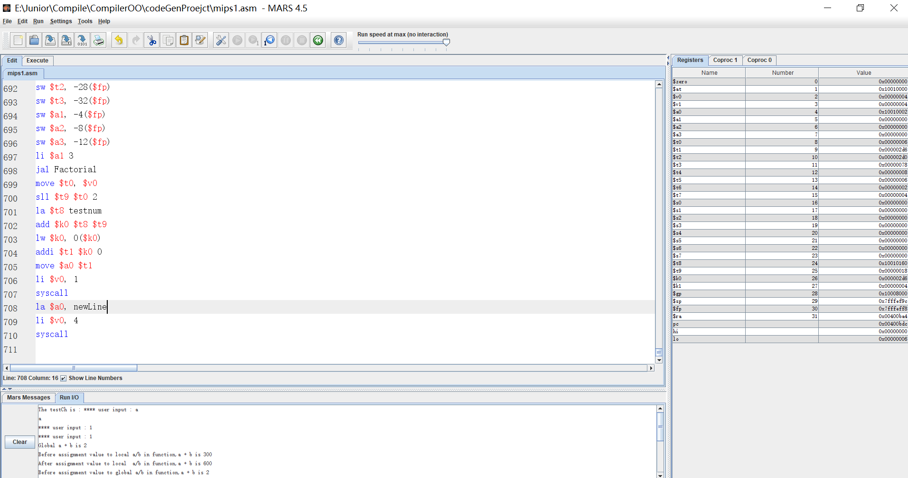

## C-Compile `README` FOR ENGLISH

> ### This is an English version for Non-Chinese Programmers.

[TOC]

### To See the Statistic of my code

```
cloc-1.64.exe ./
```



### How To Run it and See the result

#### `Environment`

- clang++

#### `prerequisit`

- Visual Studio 2019 or `Clion`
- `MARs` Simulator (I pack it in my project)

#### `You Can Do This`

```
1. Add all the code files including headers and source code into Visual studio workplace and then just click "run" To See the result in mips.txt

2. copy mips.txt to "mars simulator" and run for the final result of your input file.
```


## `FrontEnd`

> Include Syntax-Parse and Lexical-Parse

#### `LexicalParse `

`LexicalParser` is to identify the words, including variable name, constant name, function name and C's Key-word.

#### `Syntaxparse`

`Syntaxparse` is to identify syntax composition by using recursion method.

#### `SymbolItem `

`SymbolItem` is used for keep some crucial information of a symbol.

#### `SymbolTable`

`SymbolTable` is one of the most important part of this project which is to store all the symbol information globally and locally.

## `BackENd`



#### `BasicBlock`

```
In compiler construction, a basic block is a straight-line code sequence with no branches in except to the entry and no branches out except at the exit. This restricted form makes a basic block highly amenable to analysis. Compilers usually decompose programs into their basic blocks as a first step in the analysis process. Basic blocks form the vertices or nodes in a control flow graph.

## reference on Google Wikipedia
:: https://en.wikipedia.org/wiki/Basic_block
```

#### `FlowGraph`

*Generally known as flow-diagram*

```
A data-flow diagram (DFD) is a way of representing a flow of a data of a process or a system. It can describe the data flow between each basicblock. And every flowGraph contains the code sequence in a function.

The utilization of flowGraph is for global register distribution.
```

#### `optimizer`

> Top-Layer for optimize the code for `mips` running.

```
Optimizer performs as a switch to start the optimizing process in each flowGraph.

But before we get start, we need to divide the tmpCode sequence by function-scope.
```

#### `MipsGenerator`

```
We assume that all the TmpCode sequnce have been optimized and store in tmpCodeVector.
All we should do is to translate the structure version into mips code.
```

#### `TmpCode Structure`

> I think you may speculate the meaning of each composition...

```
struct FourComExpr {
    TmpCodeType type;
    RetType valueType; 
    string target; 
    string index; 
    string left;  
    string right;
    string index1 = "";
    string index2 = ""; 
    string op;
    int arrayOrVar{}; 
    vector<SymbolItem> paraSet;
    vector<ExpRet> valueParaTab; 
    string varScope;
};
```

## `ErrorParse`

> #### During the whole compiling process, we need to detect some errors

###### My `ErrorParser` is able to identify the error in C below:

```
enum SyntaxError {
    LexError, // lexical error
    EmptyFile, // 
    RedantCont, // There's redundant context after main function
    LackMain, // 
    ArrayDefError, // 
    LackSemicn, // 
    LackRparent, // 
    LackRbrack, 
    LackWhile, // do-while with no 'while'
    ConstDefError,
};


enum SemanticError {

    Redeclare, // 
    Nodeclare, // variable is used before defination
    IndexError, // Array index out of bound
    ParaNumError, // The nums of parameters of a function is not matched
    ParaTypeError, // The type of parameters is not matched
    ConstAssError, // assigned to a CONSTANT
    AssTypeError, // Assigned with wrong value type
    ZeroError, // divide zero
    CondParseError, // 
};

enum ReturnError {
    voidReturn, // void func with unmatched return state
    lackReturn, // in function with return value but lacking valid return
    retTypeError, // with wrong return value
};
```

## How To See The File Structure

```
cmd :: tree -f 
```




## `Show you The Case`

### `input`

```
see in testfile.txt
```

### `TmpCode :: Before Optimize`

```
see in tmpcode.txt
```

### `TmpCode :: After optimize`

```
see in optTmpCode.txt
```

### `Mips Code :: For Assemble`

```
see in mips.txt
```

### `Running On Mars`



```
Then You can see the result in the console...
```

